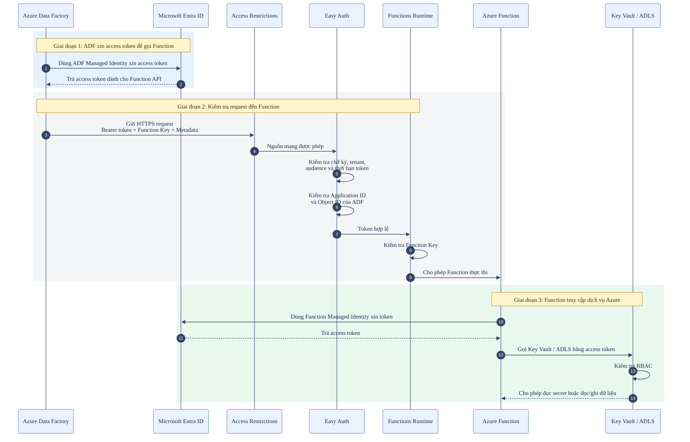

# Bảo mật luồng ADF → Azure Function → Azure Services

## 1. Mục đích

Bảo đảm chỉ đúng Azure Data Factory (ADF) được gọi Azure Function và Function chỉ được truy cập các tài nguyên Azure đã cấp quyền.

## 2. Các lớp bảo mật

| Lớp | Luồng | Tác dụng |
|---|---|---|
| HTTPS/TLS | ADF → Function | Mã hóa request trên đường truyền |
| Access Restrictions | Mạng → Function | Giới hạn nguồn mạng được kết nối |
| Entra Authentication (Easy Auth) | ADF → Function | Xác thực access token |
| ADF allowlist | ADF → Function | Chỉ cho đúng ADF được gọi |
| Function Key | ADF → Function | Khóa truy cập ở cấp Function |
| Function Managed Identity | Function → Key Vault/Storage | Function xác thực mà không lưu key trong code |
| RBAC | Function → Key Vault/Storage | Quy định Function được đọc hoặc ghi tài nguyên nào |

> Với Azure Function Activity, ADF linked service yêu cầu Function Key. Trong secure setup, Microsoft hướng dẫn thêm Application ID và Object ID của ADF vào allowlist.

## 3. Luồng xác thực và phân quyền

```text
1. ADF dùng System-assigned Managed Identity xin access token
   dành cho Function API từ Microsoft Entra ID.

2. Entra ID xác thực ADF và trả access token đã ký.
   Các claim quan trọng gồm:
   - aud: Function API nhận token
   - iss/tid: nơi và tenant phát hành token
   - exp: thời gian hết hạn
   - oid: Object ID của ADF Managed Identity
   - appid hoặc azp: Application ID của caller

3. ADF gửi HTTPS request tới Function, gồm:
   - Authorization: Bearer <access_token>
   - Function Key
   - Metadata của pipeline

4. Access Restrictions kiểm tra nguồn mạng, nếu được cấu hình.

5. Easy Auth (App Service Authentication) kiểm tra:
   - Chữ ký token
   - Issuer và tenant
   - Audience
   - Thời hạn
   - Application ID và Object ID của ADF trong allowlist

6. Azure Functions Runtime kiểm tra Function Key.

7. Function dùng Managed Identity riêng để xin token truy cập
   Key Vault và ADLS/Storage.

8. Key Vault và Storage kiểm tra RBAC trước khi cho phép đọc/ghi.
```

## 4. Vai trò của từng thành phần

| Thành phần | Cách hiểu ngắn gọn |
|---|---|
| ADF Managed Identity | Danh tính của bên gọi Function |
| Function API App Registration | Định danh Function API và xác định audience của token |
| Easy Auth | Lớp đứng trước Function để xác thực token và giới hạn caller |
| Function Key | Khóa truy cập của Function, được runtime kiểm tra |
| Function Managed Identity | Danh tính của Function khi gọi dịch vụ Azure khác |
| RBAC | Quyền của Managed Identity trên từng tài nguyên |

## 5. Sơ đồ tổng quát


