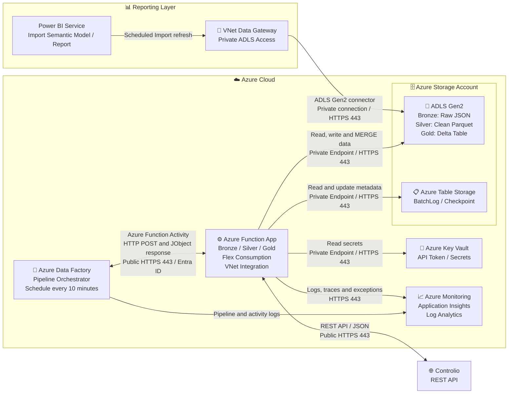

# Solution Architecture

## High-Level Architecture

Link draw.io: https://drive.google.com/file/d/1v6PH8ilraKcIoujXpy5zYeWfiFKU5-Y3/view?usp=sharing

Link mermaid: https://mermaid.ai/d/97bcb1b5-db8d-4ab7-8cc3-d510b812a484

> **Note:** `BatchLog` and `Checkpoint` are stored in Azure Table Storage. Azure Table Storage and ADLS Gen2 can reside in the same Storage Account (as shown), or in separate accounts.

---

## Architectural Responsibilities

### Azure Data Factory

* Trigger pipeline execution on a schedule every 10 minutes
* Pass run parameters to each Azure Function: RunId, window start/end, resume_batch_id
* Receive JObject response (batch_id, status) from each Function activity
* Enforce activity dependency: Bronze → Silver → Gold
* Perform activity-level retry on transient failures
* Route to failure branch and terminate with a Fail Activity on unrecoverable errors

### Azure Function App

* Generate or reuse a deterministic `batch_id` derived from ADF RunId and trigger time
* Check BatchLog for idempotency before starting each stage
* Retrieve Controlio API token from Azure Key Vault using Managed Identity
* Call Controlio REST API with pagination using `prev` cursor
* Write raw JSON pages to Bronze zone in ADLS Gen2
* Read Bronze data, validate schema, normalize, and write clean Parquet to Silver zone
* Read Silver data and perform MERGE into Gold Delta table
* Read and write `PipelineBatchLog` and `PipelineCheckpoint` in Azure Table Storage
* Update Checkpoint using optimistic concurrency (ETag) after successful Gold commit
* Push structured logs, traces, and exceptions to Application Insights

### Azure Key Vault

* Store Controlio API token and other operational secrets
* Serve secrets to Azure Function via Managed Identity — no credentials stored in code or configuration

### Azure Storage Account

* **Azure Table Storage:** Hosts `PipelineBatchLog` and `PipelineCheckpoint` tables
  * `PipelineBatchLog`: tracks business state and processing results for each batch across Bronze, Silver, and Gold
  * `PipelineCheckpoint`: stores the last safely committed watermark per entity, used as the starting cursor for the next pipeline run
* **ADLS Gen2:** Hosts the data lake with three zones
  * **Bronze zone:** Raw JSON pages fetched from Controlio API, partitioned by batch_id
  * **Silver zone:** Cleaned and normalized Parquet files, partitioned by batch_id
  * **Gold zone:** Delta Lake tables, updated via MERGE on each successful batch, consumed by the reporting layer

### Application Insights

* Receive structured logs, request traces, and exceptions from Azure Functions
* Store detailed error information referenced by `error_details_ref` in BatchLog
* Provide query and alerting capability for function-level operational monitoring

### Azure Monitor / Log Analytics

* Receive ADF diagnostic logs via Diagnostic Settings: pipeline runs, activity runs, trigger runs
* Provide centralized visibility into pipeline execution history and failure patterns
* Complement Application Insights which covers function-level telemetry

### Power BI

* Connect directly to Gold Delta zone via standard ADLS Gen2 public endpoints
* Use Power Query DeltaLake.Table connector in Import mode
* Refresh dataset on a scheduled basis
* Serve KPI, SLA, and operational dashboards to report users

### Microsoft Fabric (Future Option)

* Create an ADLS Gen2 Shortcut in a Fabric Lakehouse pointing to the Gold Delta zone
* No data is copied — the shortcut references the existing storage directly
* Expose data through a Direct Lake Semantic Model for low-latency Power BI reporting
* Enables Fabric adoption without changes to the existing storage architecture
