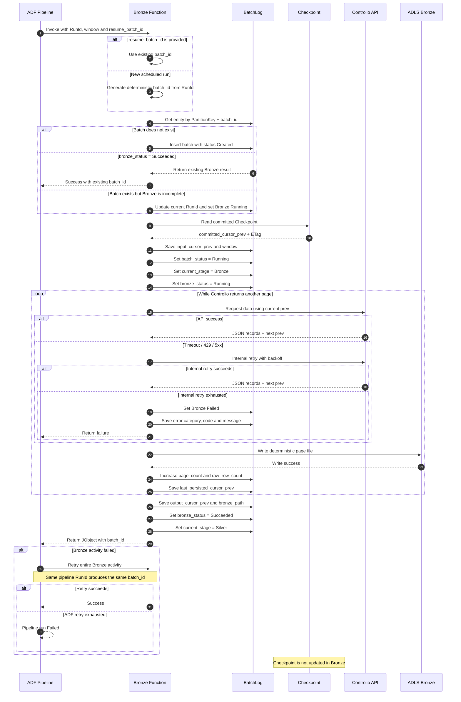
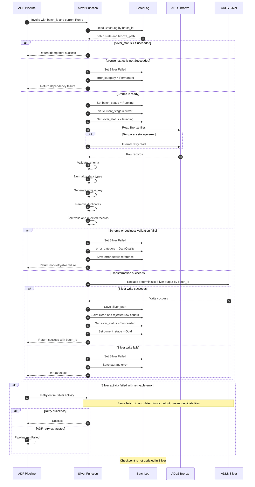
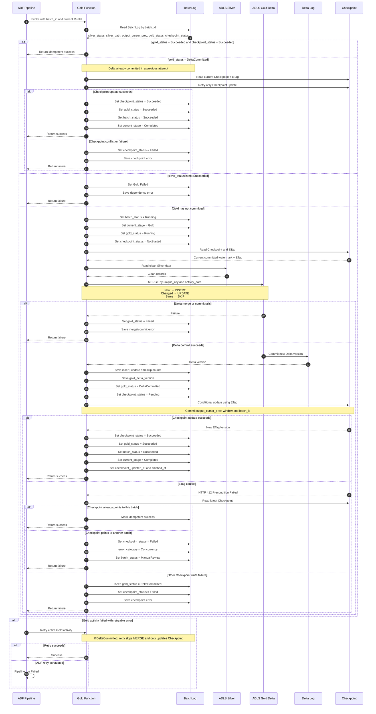
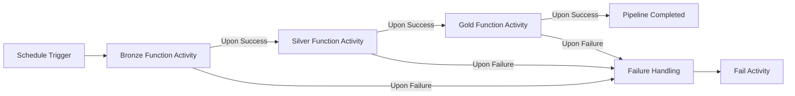

# BatchLog, Checkpoint, and Sequence Diagram Design for ADF + Azure Functions

## 1. Applied Architecture

The current pipeline flow:

```text
ADF Schedule Trigger
    ↓
Bronze Azure Function Activity
    ↓
Silver Azure Function Activity
    ↓
Gold Azure Function Activity
    ↓
Pipeline Completed
```

Responsibilities of each component:

| Component | Responsibility |
|---|---|
| ADF | Scheduling, parameter passing, orchestrating Bronze → Silver → Gold, activity retry, dependency management, and monitoring |
| Azure Function | Executing business logic, calling Controlio API, processing data, and writing to ADLS |
| BatchLog | Storing the business state and processing results of each batch |
| Checkpoint | Storing the last watermark/cursor that has been safely committed to Gold |
| ADF Monitor | Storing the technical history of pipeline runs and activity runs |

ADF knows which activities succeeded or failed, but it does not know which JSON page was written to ADLS or which cursor was committed to Gold. Therefore, `BatchLog` and `Checkpoint` are still required.

### ADF Conditional Branching

When routing Bronze → Silver → Gold, ADF must use the Bronze activity's `raw_row_count` as the single source of truth. Do not use `has_data` or `coalesce`.

Use this exact If Condition expression for the Silver branch:

```adf
@greater(
    int(activity('act_bronze_controlio').output.raw_row_count),
    0
)
```

If `raw_row_count` is missing from the Bronze activity output, the pipeline should fail clearly — do not treat it as zero.

---

## 2. Who Creates `batch_id`?

### Decision

`batch_id` is generated inside the Bronze Function, not in ADF directly.

ADF passes the following technical parameters to the Bronze Function:

```json
{
  "adf_pipeline_run_id": "@pipeline().RunId",
  "adf_pipeline_name": "@pipeline().Pipeline",
  "trigger_type": "@pipeline().TriggerType",
  "window_start_utc": "2026-06-10T10:00:00Z",
  "window_end_utc": "2026-06-10T10:10:00Z",
  "resume_batch_id": null
}
```

The Bronze Function generates a deterministic `batch_id` in the following format:

```text
{pipeline_type}_{entity_name}_{trigger_time}_{short_adf_run_id}
```

Example:

```text
raw_timeline_20260610T101000Z_7f3a91c2
```

### Why does the Function generate batch_id but still use the ADF Run ID?

ADF activity retry will invoke the entire Bronze Function again. If the Function generates a random UUID on each invocation, a retry could create an additional new batch.

Therefore:

- First run: the Function generates `batch_id` from the ADF Run ID and trigger time.
- Activity retry within the same pipeline run: the same inputs produce the same `batch_id`.
- Manual resume: ADF passes `resume_batch_id` so the Function reuses the existing batch.
- Full reprocess: `resume_batch_id` is not passed; the Function creates a new batch and may store `reprocess_of_batch_id`.

### Why is it still necessary to check if the batch already exists?

ADF manages activity state but does not manage transactions inside an Azure Function.

The following scenario can occur:

```text
Function has created the BatchLog entry
Function has written some Bronze files
Function times out before returning a response to ADF
ADF marks the activity as Failed and invokes the Function again
```

Therefore, the Function must read or upsert the BatchLog by `batch_id` to ensure idempotent processing:

- Does not exist: create the batch.
- Exists and Bronze is incomplete: continue or safely reprocess.
- Exists and Bronze has already succeeded: do not reload data; return success to ADF.

This is an idempotency check, not a replacement for ADF monitoring.

---

# 3. BatchLog Table

## 3.1. Purpose

`BatchLog` stores the business state of a data batch across Bronze, Silver, and Gold.

Information specific to Azure Queue is not stored here because the current architecture no longer uses a Queue.

## 3.2. Azure Table Storage Keys

| Property | Design |
|---|---|
| Table name | `PipelineBatchLog` |
| PartitionKey | `{source_name}|{pipeline_type}|{entity_name}|{yyyyMM}` |
| RowKey | `batch_id` |

Example:

```text
PartitionKey = controlio|raw|timeline|202606
RowKey       = raw_timeline_20260610T101000Z_7f3a91c2
```

This design allows:

- Direct lookup of a batch using `PartitionKey + RowKey`.
- Filtering batches by source, pipeline type, entity, and month.
- Avoiding placing the entire history in a single partition.

## 3.3. Proposed Columns

### A. Keys and ADF Linkage

| Column | Data type | Required | Purpose | Example |
|---|---|---:|---|---|
| `PartitionKey` | String | Yes | Azure Table partition | `controlio|raw|timeline|202606` |
| `RowKey` | String | Yes | Row key, equal to `batch_id` | `raw_timeline_20260610T101000Z_7f3a91c2` |
| `batch_id` | String | Yes | Business ID of the batch | `raw_timeline_20260610T101000Z_7f3a91c2` |
| `initial_adf_pipeline_run_id` | String | Yes | ADF Run ID that created this batch initially | ADF GUID |
| `current_adf_pipeline_run_id` | String | Yes | ADF Run ID currently processing or resuming this batch | ADF GUID |
| `adf_pipeline_name` | String | Yes | Pipeline name | `pl_controlio_timeline` |
| `trigger_type` | String | Yes | Trigger type | `ScheduleTrigger`, `Manual` |
| `trigger_time_utc` | DateTime | Yes | Trigger time | `2026-06-10T10:10:00Z` |
| `run_mode` | String | Yes | Run mode | `Scheduled`, `Resume`, `Reprocess` |
| `rerun_count` | Int32 | Yes | Number of manual resume or reprocess runs for this batch | `1` |
| `reprocess_of_batch_id` | String | No | Source batch ID if this is a new reprocess batch | `raw_timeline_...` |

`ADF activity retry` does not increment `rerun_count` because it is still the same pipeline run. `rerun_count` is only incremented when a new pipeline run continues processing the same batch.

### B. Input Data Scope

| Column | Data type | Required | Purpose | Example |
|---|---|---:|---|---|
| `pipeline_type` | String | Yes | Pipeline type | `raw`, `aggregate` |
| `source_name` | String | Yes | Data source | `controlio` |
| `entity_name` | String | Yes | API or entity | `timeline` |
| `window_start_utc` | DateTime | Yes | Start of the data fetch window | `2026-06-10T10:00:00Z` |
| `window_end_utc` | DateTime | Yes | End of the data fetch window | `2026-06-10T10:10:00Z` |
| `input_cursor_prev` | String | No | Committed cursor retrieved from Checkpoint at batch start | `2026-06-10T10:00:00Z,123,456` |
| `last_persisted_cursor_prev` | String | No | Last cursor successfully written to Bronze during the current run | `2026-06-10T10:08:00Z,123,456` |
| `output_cursor_prev` | String | No | Final cursor after Bronze has completed the full batch | `2026-06-10T10:10:00Z,123,456` |
| `activity_dates_json` | String | No | List of affected dates, serialized as JSON | `["2026-06-10"]` |

Do not mix `Date` and `String` types. All timestamps should be stored as `DateTime UTC`. JSON arrays must be serialized to String when stored in Azure Table.

### C. Batch and Stage Status

| Column | Data type | Required | Purpose | Proposed Values |
|---|---|---:|---|---|
| `batch_status` | String | Yes | Overall batch status | `Created`, `Running`, `Succeeded`, `Failed`, `Cancelled`, `ManualReview` |
| `current_stage` | String | Yes | Current stage | `Bronze`, `Silver`, `Gold`, `Checkpoint`, `Completed` |
| `bronze_status` | String | Yes | Bronze stage status | `NotStarted`, `Running`, `Succeeded`, `Failed` |
| `silver_status` | String | Yes | Silver stage status | `NotStarted`, `Running`, `Succeeded`, `Failed` |
| `gold_status` | String | Yes | Gold stage status | `NotStarted`, `Running`, `DeltaCommitted`, `Succeeded`, `Failed` |
| `checkpoint_status` | String | Yes | Checkpoint commit status | `NotStarted`, `Pending`, `Succeeded`, `Failed` |

`DeltaCommitted` is critical. It indicates that the Gold Delta has been committed but the Checkpoint may not yet have been updated. If ADF retries the Gold Function, the Function will skip the MERGE and only complete the Checkpoint update.

### D. Output Paths and Data Versions

| Column | Data type | Required | Purpose | Example |
|---|---|---:|---|---|
| `bronze_path` | String | No | Raw JSON folder path | `bronze/controlio/timeline/batch_id=.../` |
| `silver_path` | String | No | Clean Parquet folder or file path | `silver/controlio/timeline/batch_id=.../` |
| `gold_table` | String | No | Gold Delta table name | `fact_timeline` |
| `gold_delta_version` | Int64 | No | Delta version after commit | `152` |
| `schema_version` | String | No | Processing schema version | `1.0` |
| `code_version` | String | No | Function or code release version | `2026.06.1` |

### E. Control Metrics

| Column | Data type | Required | Purpose | Example |
|---|---|---:|---|---|
| `api_call_count` | Int32 | Yes | Total successful or retried API calls | `3` |
| `page_count` | Int32 | Yes | Number of pages or chunks persisted | `2` |
| `raw_row_count` | Int64 | Yes | Records written to Bronze | `10000` |
| `clean_row_count` | Int64 | Yes | Clean records in Silver | `9950` |
| `rejected_row_count` | Int64 | Yes | Invalid or error records | `50` |
| `insert_count` | Int64 | Yes | Records inserted into Gold | `9000` |
| `update_count` | Int64 | Yes | Records updated in Gold | `500` |
| `skip_count` | Int64 | Yes | Records unchanged in Gold | `450` |

All counts should be initialized to `0` rather than null for easier querying and aggregation.

### F. Error Information

| Column | Data type | Required | Purpose | Example |
|---|---|---:|---|---|
| `failed_stage` | String | No | Stage where failure occurred | `Bronze`, `Silver`, `Gold`, `Checkpoint` |
| `error_category` | String | No | Error category | `Transient`, `Configuration`, `DataQuality`, `Concurrency`, `Permanent` |
| `error_code` | String | No | Short error code | `CONTROLIO_429`, `CHECKPOINT_412` |
| `error_message` | String | No | Brief error description | `Controlio API rate limit exceeded` |
| `error_details_ref` | String | No | Link or correlation ID to App Insights or detailed log | `appinsights:operation-id` |

Do not store long stack traces directly in Azure Table. Store only enough information to locate detailed logs in Application Insights.

### G. Timestamps

| Column | Data type | Required | Purpose |
|---|---|---:|---|
| `created_at` | DateTime | Yes | Time the batch was created |
| `started_at` | DateTime | No | Time processing started |
| `bronze_started_at` | DateTime | No | Time Bronze processing started |
| `bronze_finished_at` | DateTime | No | Time Bronze processing completed |
| `silver_started_at` | DateTime | No | Time Silver processing started |
| `silver_finished_at` | DateTime | No | Time Silver processing completed |
| `gold_started_at` | DateTime | No | Time Gold processing started |
| `gold_committed_at` | DateTime | No | Time Delta commit succeeded |
| `checkpoint_updated_at` | DateTime | No | Time Checkpoint commit succeeded |
| `finished_at` | DateTime | No | Time the full batch completed |
| `failed_at` | DateTime | No | Time of the most recent failure |
| `updated_at` | DateTime | Yes | Time of the most recent update |

---

# 4. Checkpoint Table

## 4.1. Purpose

Checkpoint stores only the state that has been safely committed to Gold.

The cursor must not be written to Checkpoint immediately after Bronze or Silver.

Rules:

```text
Bronze success
    → Checkpoint not updated

Silver success
    → Checkpoint not updated

Gold Delta commit success
    → Checkpoint updated

Checkpoint update success
    → batch_status = Succeeded
```

## 4.2. Azure Table Storage Keys

| Property | Design |
|---|---|
| Table name | `PipelineCheckpoint` |
| PartitionKey | `{source_name}|{pipeline_type}` |
| RowKey | `entity_name` |

Example:

```text
PartitionKey = controlio|raw
RowKey       = timeline
```

Each source + pipeline type + entity has exactly one active checkpoint.

## 4.3. Proposed Columns

| Column | Data type | Required | Purpose | Example |
|---|---|---:|---|---|
| `PartitionKey` | String | Yes | Checkpoint partition | `controlio|raw` |
| `RowKey` | String | Yes | Entity checkpoint key | `timeline` |
| `checkpoint_id` | String | Yes | Human-readable ID | `controlio_raw_timeline` |
| `pipeline_type` | String | Yes | Pipeline type | `raw` |
| `source_name` | String | Yes | Data source | `controlio` |
| `entity_name` | String | Yes | Entity or API | `timeline` |
| `watermark_type` | String | Yes | Watermark type | `Cursor`, `Timestamp`, `Date` |
| `is_initialized` | Boolean | Yes | Whether a successful checkpoint exists | `true` |
| `committed_window_start_utc` | DateTime | No | Window start of the last batch committed to Gold | `2026-06-10T10:00:00Z` |
| `committed_window_end_utc` | DateTime | No | Window end of the last batch committed to Gold | `2026-06-10T10:10:00Z` |
| `committed_cursor_prev` | String | No | Last cursor committed to Gold | `2026-06-10T10:10:00Z,123,456` |
| `committed_date` | DateTime | No | Date-based watermark for aggregate pipelines | `2026-06-10T00:00:00Z` |
| `last_success_batch_id` | String | No | Last batch ID that successfully updated this checkpoint | `raw_timeline_...` |
| `last_success_adf_pipeline_run_id` | String | No | ADF Run ID of the last successful batch | ADF GUID |
| `last_success_at` | DateTime | No | Time the last batch completed successfully | `2026-06-10T10:12:00Z` |
| `checkpoint_version` | Int64 | Yes | Logical version for audit purposes | `152` |
| `updated_at` | DateTime | Yes | Time this checkpoint was last updated | `2026-06-10T10:12:05Z` |

Azure Table provides a system-managed `ETag`. The Gold Function must update the Checkpoint using optimistic concurrency:

1. Read the Checkpoint and receive the ETag.
2. Commit the Gold Delta.
3. Update the Checkpoint with the ETag condition.
4. If the ETag no longer matches, Azure Table returns `412 Precondition Failed`.
5. The Function re-reads the Checkpoint:
   - If it already points to the current batch: treat as idempotent success.
   - If it points to a different batch: flag as a concurrency conflict and do not overwrite blindly.

---

# 5. Sequence Diagram — Bronze

Link: https://mermaid.ai/d/c785a262-6091-4901-8e8c-2cc5c47073a4



---

# 6. Sequence Diagram — Silver

Link: https://mermaid.ai/d/9ee2a4a3-f390-4700-8a1f-36ac69516ac4



---

# 7. Sequence Diagram — Gold and Checkpoint

Link: https://mermaid.ai/d/ea0cf6a3-371d-4dc6-9976-ac4a9770da94



---

# 8. ADF Pipeline Control Flow



The failure-handling branch must end with a `Fail Activity`. Without it, ADF may report the pipeline as Succeeded even though a data processing activity has failed.

---

# 9. Retry Rules

## Function-Level Retry

Retry only on transient errors:

- HTTP 429
- HTTP 500, 502, 503, 504
- Network timeout
- ADLS temporarily unavailable
- Checkpoint write temporary failure

Do not retry on permanent errors:

- Invalid API token
- Misconfiguration
- Invalid schema
- Missing required fields
- Business validation failure

## ADF Activity Retry

ADF retries the entire Azure Function Activity.

Recommended initial settings:

```text
Retry count: 2 or 3
Retry interval: 60–120 seconds
```

The Function must be idempotent because each retry is a full re-invocation of the Function.

---

# 10. Azure Function Activity Timeout

Azure Function Activity invokes the Function via HTTP. The Function must return a response within the HTTP invocation timeout limit.

If Bronze, Silver, or Gold may run longer than a few minutes, one of the following approaches should be used:

1. Split the batch into smaller units so each Function completes within the time limit.
2. Use Durable Functions with an async pattern and allow ADF to poll for the status.

The `BatchLog` and `Checkpoint` design in this document applies to both synchronous Functions and Durable Functions.

---

# 11. Design Summary

## BatchLog

Stores:

- Which data batch is being processed.
- Input cursor, last persisted cursor, and output cursor.
- Bronze and Silver paths, and Gold Delta version.
- Row counts and merge results.
- Business state for resume and reprocess operations.
- `DeltaCommitted` status to handle failures between Gold commit and Checkpoint update.

## Checkpoint

Stores the watermark that has been safely committed after Gold.

## ADF

ADF manages:

- Scheduling
- Activity dependency
- Activity retry
- Pipeline and activity monitoring
- Failure branch
- Manual rerun

## Azure Function

The Function manages:

- Creating or reusing `batch_id`
- Idempotency
- API pagination using `prev`
- Bronze, Silver, and Gold processing
- BatchLog updates
- Checkpoint commit